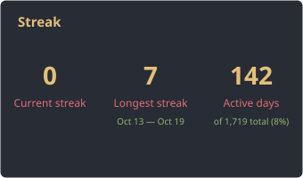
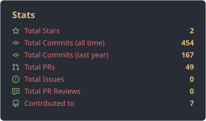
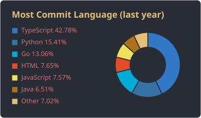

<div align="center">

[](https://git.io/typing-svg)

<br/>

**Estudiante de 9º semestre de Ingeniería de Sistemas y Computación** en la Universidad del Quindío 🇨🇴

<br/>

[](mailto:jhonyalexanderpereaperea@gmail.com)
[](https://www.linkedin.com/in/jhony-alexander-perea-perea/)
[](https://github.com/JhonyAlexanderPerea)


</div>

<br/>

## 👨‍💻 Sobre mí

```yaml
nombre: Jhony Alexander Perea Perea
carrera: Ingeniería de Sistemas y Computación
universidad: Universidad del Quindío
enfoque: Desarrollo Backend & Aplicaciones de Escritorio
intereses: [ "código limpio", "arquitectura de software", "DJ 🎧", "deporte" ]
```

- 🔭 Actualmente trabajando en proyectos con **Java, Spring Boot y React**
- 🌱 Aprendiendo sobre **desarollo de aplicaciones para dispositivos móviles**
- 💬 Pregúntame sobre: Java, Spring Boot, JavaFX, React o bases de datos

<br/>

## 🛠️ Stack Tecnológico

<div align="center">

**Lenguajes**


**Frameworks y librerías**


**Bases de datos, herramientas e infraestructura**


<ima src="https://img.shields.io/badge/Android%20Studio-3DDC84?style=flat&logo=AndroidStudio&logoColor=white"/>
</div>

<br/>

## 📊 Estadísticas de GitHub

<div align="center">





</div>

<br/>

## 📌 Proyectos Destacados


<div align="center">

<a href="https://github.com/JhonyAlexanderPerea/proyectoTLF">
  
</a>

</div>


<br/>

## 📫 Contáctame

<div align="center">

¿Tienes una oportunidad, una idea o simplemente quieres hablar de código? Escríbeme, siempre estoy abierto a nuevos proyectos y retos.

[](mailto:jhonyalexanderpereaperea@gmail.com)
[](https://www.linkedin.com/in/jhony-alexander-perea-perea/)

<br/>


</div>
