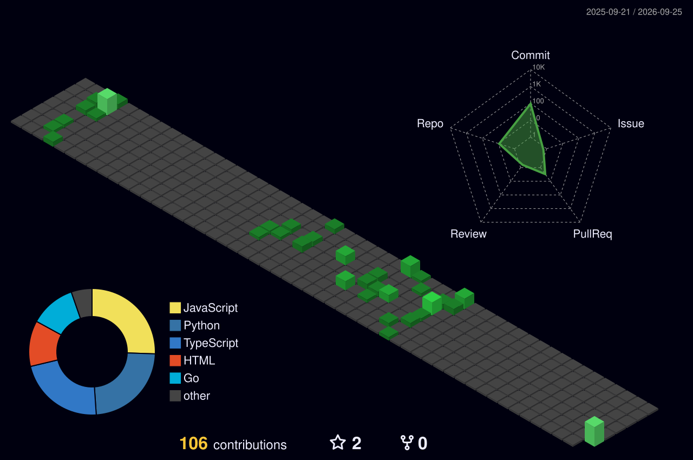
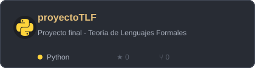

<div align="center">


[](https://git.io/typing-svg)

**Estudiante de 9º semestre de Ingeniería de Sistemas y Computación**

Universidad del Quindío 🇨🇴


[](https://u8views.com/github/JhonyAlexanderPerea)


<br><br>

<a href="https://github.com/JhonyAlexanderPerea">
  
  
</a>

</div>

<br>

## 👨‍💻 Sobre mí

```yaml
nombre: Jhony Alexander Perea Perea
carrera: Ingeniería de Sistemas y Computación
universidad: Universidad del Quindío
enfoque: Desarrollo Backend & Aplicaciones de Escritorio
intereses: [ "código limpio", "arquitectura de software", "DJ 🎧", "deporte" ]
```

- 🔭 Actualmente trabajando en proyectos con **Java, Spring Boot y React**
- 🌱 Aprendiendo sobre **desarrollo de aplicaciones para dispositivos móviles**
- 💬 Pregúntame sobre **Java, Spring Boot, JavaFX, React o bases de datos**

<div align="center">

<br>

[](https://github.com/PiyushSuthar/github-readme-quotes)

</div>

<div align="center">
  <h2>
    <a href="https://jhonyalexanderperea.github.io/portfolio/">🌐 Visita mi Portafolio Web</a>
  </h2>
</div>


<br>

## 🛠️ Stack tecnológico

<div align="center">

## **Lenguajes**

<p align="center">
  <a href="https://skillicons.dev">
    
  </a>
</p>

<br>

## **Frameworks y librerías**

<br>

<p align="center">
  <a href="https://skillicons.dev">
    
  </a>
</p>

<br>

## **Bases de datos, herramientas e infraestructura**

<p align="center">
  <a href="https://skillicons.dev">
    
  </a>
</p>

</div>

<br>

## 🏆 Trofeos de GitHub

<div align="center">


</div>

<br>

## 📊 Estadísticas de GitHub

<div align="center">
  
</div>

<br>

## Contribuciones

<div align="center">

<picture>
  <source media="(prefers-color-scheme: dark)" srcset="./profile-3d-contrib/profile-night-green.svg" />
  <source media="(prefers-color-scheme: light)" srcset="./profile-3d-contrib/profile-day-view.svg" />
  
</picture>

</div>

<br>

<div align="center">

<picture>
  <source media="(prefers-color-scheme: dark)" srcset="./output/snake/github-contribution-grid-snake-dark.svg" />
  <source media="(prefers-color-scheme: light)" srcset="./output/snake/github-contribution-grid-snake.svg" />
  
</picture>

</div>

<br>

## 📌 Proyectos destacados

<div align="center">

<a href="https://github.com/JhonyAlexanderPerea/proyectoTLF">
  
</a>

</div>

<br>

## 📫 Contáctame

<div align="center">

¿Tienes una oportunidad, una idea o simplemente quieres hablar de código? Escríbeme; siempre estoy abierto a nuevos proyectos y retos.

[](mailto:jhonyalexanderpereaperea@gmail.com)
[](https://www.linkedin.com/in/jhony-alexander-perea-perea/)
[]([https://www.instagram.com/tu_usuario](https://www.instagram.com/jhonyalexander_perea/))
[](https://github.com/JhonyAlexanderPerea)

</div>


